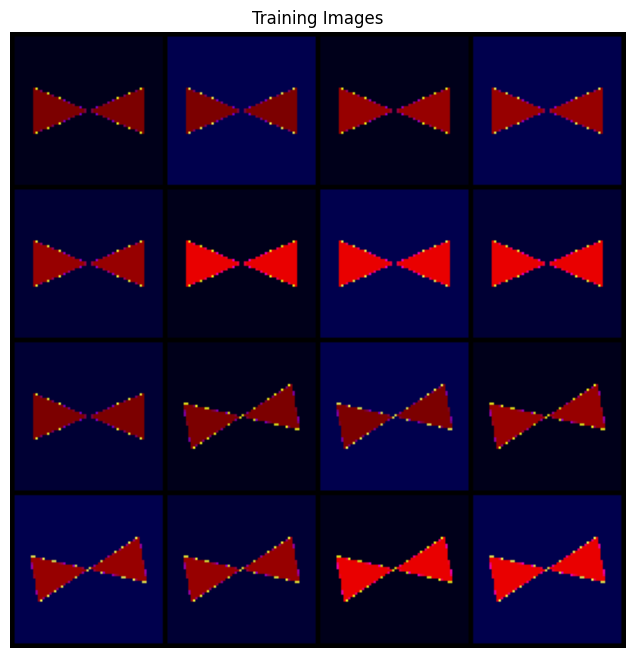
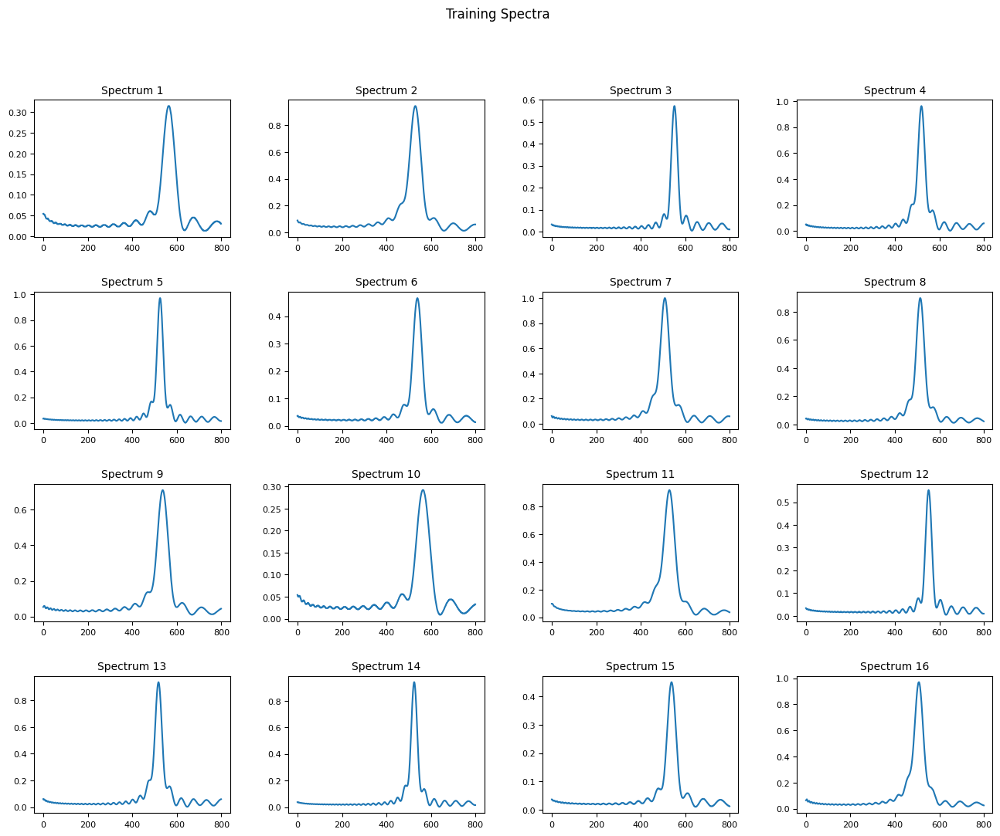

# GenAI_project

## setting up the environment 

Create a venv or conda environment with Python 3.13
```bash
conda create -n genai_project python=3.13
conda activate genai_project
```

Install the required dependencies
```bash
pip install torch torchvision matplotlib numpy pandas imageio-ffmpeg
```

# Instruction for the Dataset

Extract the dataset from `data/Images.zip` such that the images are located in `data/Images/`. The dataset should be organized as follows:
```
data/
├── Images/
    ├── image1.png
    ├── image2.png
    ├── ...
```

The dataset is acquired from the paper "Global Inverse Design across Multiple Photonic Structure Classes Using Generative Deep Learning" (https://doi.org/10.1002/adom.202100548) where they have provided the dataset at [Dataset link](https://github.com/Raman-Lab-UCLA/Multiclass_Metasurface_InverseDesign/tree/main/Training_Data). It consists of 18770 images (12,632 metal-insulator-metal and 6,138 hybrid dielectric structures) of size 64×64×3 pixels, representing different metasurface designs.

The images are encoded with planar geometries (G), material properties of the metasurface resonator (M), and the thicknesses of the dielectric layer (T) information. The pixel values in the images are normalized to the range [0, 1], where each pixel's Red, Blue and Green channels correspond to $M_1$ (plasma frequency for the metal layer), $M_2$ (refractive index for the dielectric layer), and $T$ (thickness of the dielectric layer), respectively. For MIM structures, the $M_2$ values are set to 0, while for hybrid dielectric structures, the $M_1$ values are set to 0. This implies that for MIM structures, the image is Red and Blue combinations, while for hybrid dielectric structures, the image is Red and Green combinations. The thickness information is encoded into the Blue channel of the substrate, though this is semantically inaccurate with respect to pixels. But, we can clearly observe the Geometry information through the contrast Red and Green channels with blue substrate. An example batch of MIM structures are shown below:


For each of such images, we have a corresponding spectra of 800 points in the `data\absorptionData_HybridGAN.csv` file. The spectra is the absorption spectrum of the metasurface design across a range of wavelengths. The absorption spectrum gives insight in the Q-factor through the amplitude of the absorption peak and the resonant wavelength through the location of the absorption peak. The spectra is normalized to the range [0, 1] as well. An example batch of spectra (corresponding to the above batch of MIM structures) is shown below:


# Instruction for the Notebook

The notebook `data_preprocess.ipynb` is designed to visualize the dataset and test any data preprocessing steps. You can run the notebook to visualize the images and spectra, and to test any data preprocessing steps you may want to apply before training the DCGAN model.


The notebook `test_dcgan_model.ipynb` is designed to train a DCGAN model on the metasurfaces dataset. Please edit [cell 5]() in the notebook to set up the experiment settings and training hyperparameters:
- Experiment settings: Set a trial name for saving results and set a manual seed for reproducibility.
- Training hyperparameters: Set the number of epochs, batch size, learning rate, and other relevant hyperparameters for training the DCGAN model.

