<center>
    <h1>Generative AI for Inverse Design of Metasurfaces</h1>
    <p><b> Adhilsha A, Pranav Challapalli, Chandrakala Pannela </b> <br> {se25pcse007, se25pecm003, se25ecm004} @mahindrauniversity.edu.in </p>
    <p>Date: 01 June 2026</p>
</center>

<center> [<a href="./report.pdf" download>DOWNLOAD REPORT</a>] [<a href="./data/absorptionData_HybridGAN.csv" download>DOWNLOAD ABSORPTION DATA</a>] [<a href="./data/Images.zip" download>DOWNLOAD IMAGES</a>] </center>

## Table of Contents
- [Instruction for the Dataset](#instruction-for-the-dataset)
  - [Enviroment Setup](#enviroment-setup)
  - [Model Architecture](#model-architecture)
    - [Forward Predictor](#forward-predictor)
    - [Design Decoder](#design-decoder)
    - [Spectrum Encoder](#spectrum-encoder)
    - [Latent Diffusion Denoiser](#latent-diffusion-denoiser)
  - [Results and Discussion](#results-and-discussion)
    - [Forward Predictor](#forward-predictor-1)
    - [Design Decoder](#design-decoder-1)
    - [Latent Diffusion Denoiser](#latent-diffusion-denoiser-1)
  - [Ablation Studies and Training Times](#ablation-studies-and-training-times)
  - [Conclusions and Future Work](#conclusions-and-future-work)

## setting up the environment 

Create a venv or conda environment with Python 3.13
```bash
conda create -n genai_project python=3.13
conda activate genai_project
```

Install the required dependencies
```bash
pip install torch torchvision matplotlib numpy pandas imageio-ffmpeg
```

# Instruction for the Dataset

Extract the dataset from `data/Images.zip` such that the images are located in `data/Images/`. The dataset should be organized as follows:
```
data/
├── Images/
    ├── image1.png
    ├── image2.png
    ├── ...
```

The dataset is acquired from the paper "Global Inverse Design across Multiple Photonic Structure Classes Using Generative Deep Learning" (https://doi.org/10.1002/adom.202100548) where they have provided the dataset at [Dataset link](https://github.com/Raman-Lab-UCLA/Multiclass_Metasurface_InverseDesign/tree/main/Training_Data). It consists of 18770 images (12,632 metal-insulator-metal and 6,138 hybrid dielectric structures) of size 64×64×3 pixels, representing different metasurface designs.

The images are encoded with planar geometries (G), material properties of the metasurface resonator (M), and the thicknesses of the dielectric layer (T) information. The pixel values in the images are normalized to the range [0, 1], where each pixel's Red, Blue and Green channels correspond to $M_1$ (plasma frequency for the metal layer), $M_2$ (refractive index for the dielectric layer), and $T$ (thickness of the dielectric layer), respectively. For MIM structures, the $M_2$ values are set to 0, while for hybrid dielectric structures, the $M_1$ values are set to 0. This implies that for MIM structures, the image is Red and Blue combinations, while for hybrid dielectric structures, the image is Red and Green combinations. The thickness information is encoded into the Blue channel of the substrate, though this is semantically inaccurate with respect to pixels. But, we can clearly observe the Geometry information through the contrast Red and Green channels with blue substrate.

For each of such images, we have a corresponding spectra of 800 points in the `data\absorptionData_HybridGAN.csv` file. The spectra is the absorption spectrum of the metasurface design across a range of wavelengths. The absorption spectrum gives insight in the Q-factor through the amplitude of the absorption peak and the resonant wavelength through the location of the absorption peak.

The dataset RGB encoding and sample images are given in the figure below.

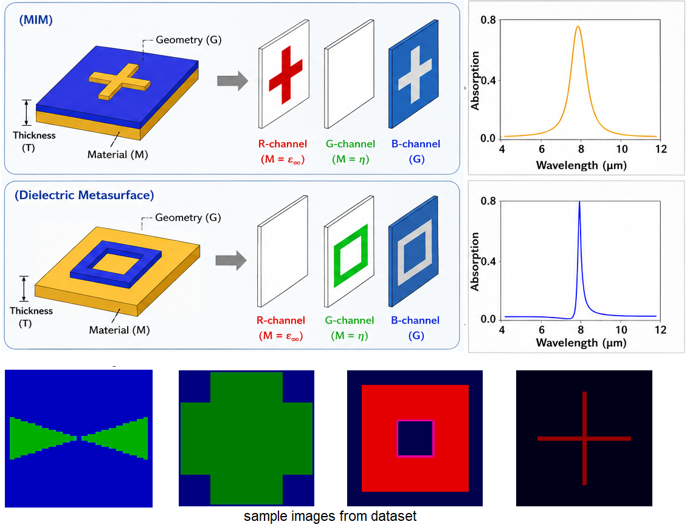

The objective is to design and train a Diffusion Model with a learned guidance module that generates a physically realizable metasurface design whose corresponding absorption spectrum closely matches the target spectrum. The task is summarized in the figure below. The architecture is explained in coming sections.

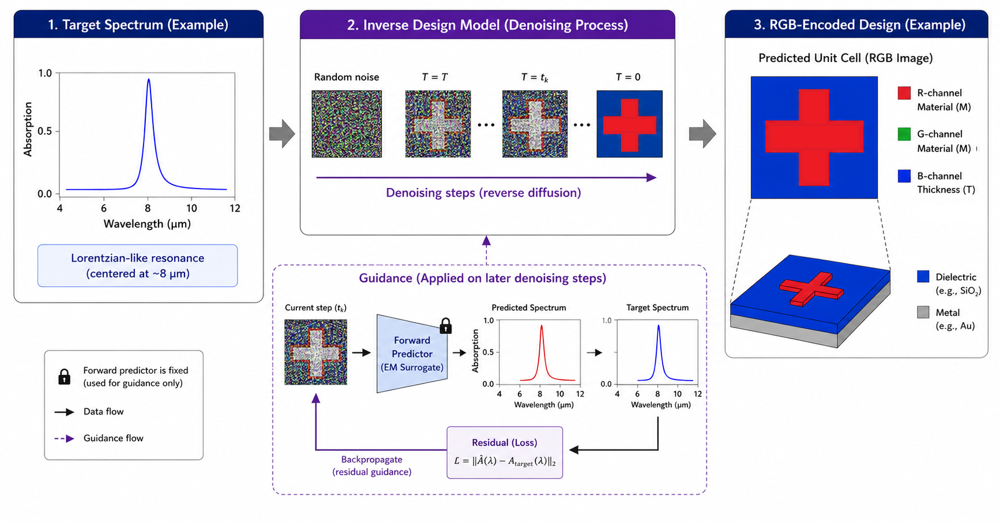

## Enviroment Setup

The conda environment has been saved in the `requirements.yaml` file. You can create the environment using the following command:
```bash
conda env create -f requirements.yaml
conda activate genai_gpu
```
## Model Architecture

For this task, a diffusion model was designed with the following components:

1. Spectral Encoder (spectrum → embedding)
2. Latent Diffusion Module (noise → latent)
3. Design Decoder (latent → image)
4. Forward Predictor (guidance)

The core idea of this architecture is to use a latent diffusion model to refine a meaningful latent representation conditioned on a target absorption spectrum encoded by the Spectrum Encoder. The resulting latent representation is then passed through the Design Decoder to generate the RGB-encoded design. The Design Decoder is trained on the same dataset as part of an Autoencoder module using a reconstruction objective. During the final 35% of the diffusion process, the noisy latent representation is periodically decoded into a design, passed through the Forward Predictor, and guided using the residual error between the predicted and target spectra. Each component is discussed in detail in the following subsections. The overall architecture is shown in Figure below.
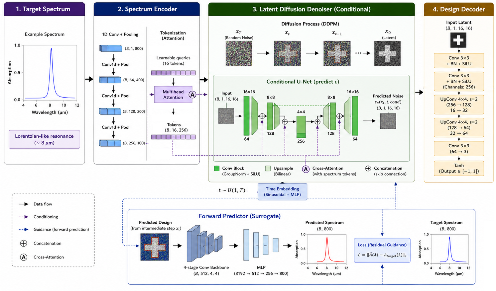

### Forward Predictor

The purpose of the Forward Predictor is to take an RGB-encoded image as input and predict the corresponding absorption spectrum. It consists of a four-stage strided convolutional backbone for spatial feature extraction, followed by a three-layer MLP with a sigmoid activation at the final layer.

The model is trained using Mean Squared Error (MSE/L2) loss between the predicted and ground-truth spectra. Mean Absolute Error (MAE) and spectral band-specific RMSE are also monitored for diagnostic purposes. A compact MLP is employed after the convolutional backbone to balance predictive capacity and inference speed, as the Forward Predictor is repeatedly used during the guidance stage of diffusion. Training is performed using the Adam optimizer with a learning rate of approximately `1 × 10⁻⁴`, and early stopping is applied based on validation RMSE. This module is trained independently and kept frozen throughout the remainder of the experiments.

### Design Decoder

The Design Decoder, together with the Design Encoder, forms the Autoencoder module responsible for mapping latent representations to RGB-encoded images. The Design Encoder consists of four strided convolutional layers with kernel size 4 and stride 2. Batch Normalization and ReLU activations are applied between convolutional layers.

The Design Decoder begins with two 3×3 convolutional layers followed by Batch Normalization and SiLU activation functions. Two ConvTranspose2D upsampling blocks are then used to progressively reconstruct the final image. Similar encoder–decoder architectures have been widely adopted in inverse design and generative modeling literature.

For training, pixel-wise L1 loss is preferred due to its ability to produce sharper reconstructions, while L2 loss is used in situations where additional training stability is required.

A Convolutional Variational Autoencoder (VAE) was also explored as a potential alternative to the deterministic autoencoder. The VAE uses a convolutional backbone to generate a flattened latent representation and is trained using a combination of reconstruction loss and KL-divergence regularization. The motivation behind this variant is to encourage a more structured and semantically meaningful latent space representation of the designs.

### Spectrum Encoder

The purpose of the Spectrum Encoder is to transform a one-dimensional absorption spectrum into a compact embedding suitable for conditioning the diffusion model. It produces a fixed-length token sequence that is later used for cross-attention conditioning within the denoising network.

The encoder consists of three Conv1D blocks interleaved with MaxPooling layers to progressively compress spectral information. The resulting feature maps are processed using a cross-attention mechanism operating on a set of learnable query tokens. These queries attend to the convolutional features to capture both local spectral characteristics and long-range relationships across different wavelength regions. This design enables the model to represent spectral features while preserving information about their relative positions within the spectrum.

The Spectrum Encoder is typically trained end-to-end alongside the diffusion denoiser using the denoising objective described in the following section.

### Latent Diffusion Denoiser

The Latent Diffusion Denoiser is a U-Net-style architecture that operates in a spatial latent space of size `16 × 16`. Its objective is to predict the noise residuals required for DDPM training while being conditioned on spectral tokens through cross-attention layers.

Each block consists of Group Normalization, Conv2D layers, and SiLU activations, together with timestep embeddings projected through a time-conditioning MLP. Residual connections are incorporated throughout the network, and skip connections link the encoder and decoder paths across the bottleneck.

During the upsampling stage, bilinear interpolation is used, followed by concatenation with the corresponding skip feature maps. The denoiser is trained using MSE loss between the predicted noise and the true noise sampled according to the DDPM scheduler. This objective enables the network to learn the reverse diffusion process and generate latent representations consistent with the target absorption spectrum.

## Results and Discussion

As described in the Methods section, the Forward Predictor and Autoencoder (Design Encoder and Design Decoder) were trained first, followed by the Latent Diffusion Model and Spectrum Encoder. The results obtained from each component are discussed below.

### Forward Predictor

Training the Forward Predictor was relatively straightforward and provided strong evidence that the model can serve as an effective guidance mechanism during DDPM training. The training curve demonstrates stable convergence , while the predicted spectra closely match the ground-truth spectra.

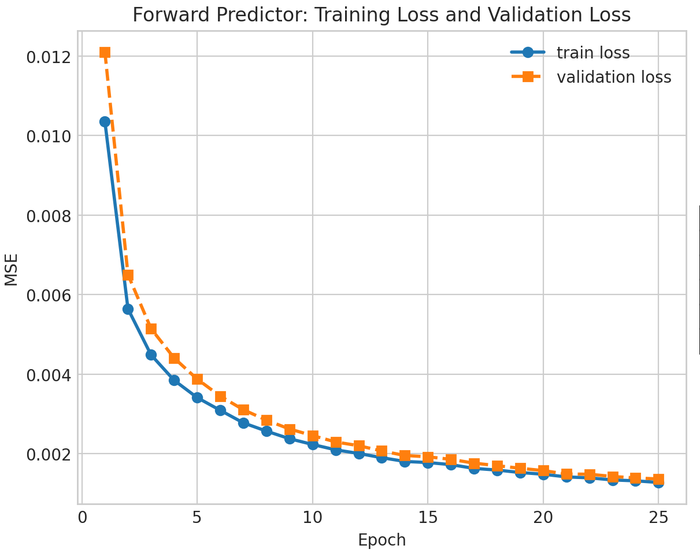

**Figure:** Forward Predictor Training Curve

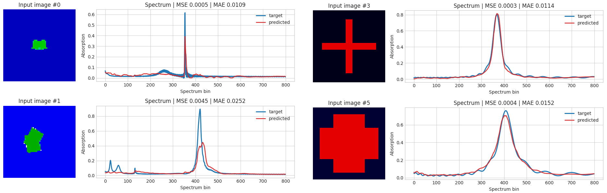

**Figure:** Forward Predictor Samples

It is worth noting that the predicted spectra exhibit slightly reduced amplitudes and minor variations compared to the ground truth. This behavior is more pronounced for dielectric metasurfaces, whereas MIM metasurfaces retain better predictive accuracy. Although the exact cause remains inconclusive, it may be related to the thickness encoding used in the RGB representation of the designs. Since thickness and pixel values are not strongly correlated, the encoding may introduce semantic inconsistencies that affect prediction quality.

### Design Decoder

As shown in Figure `decoder_training`, the Autoencoder (AE) achieved significantly better reconstruction performance than the Variational Autoencoder (VAE). This behavior is likely due to the smoother latent space enforced by the VAE, which negatively affected reconstruction fidelity and generation quality, as illustrated in Figure `decoder_samples`.

For the intended inverse-design application, preserving sharp structural details is more important than obtaining a highly regularized latent space. Therefore, the deterministic Autoencoder was selected as the Design Decoder component of the final architecture.

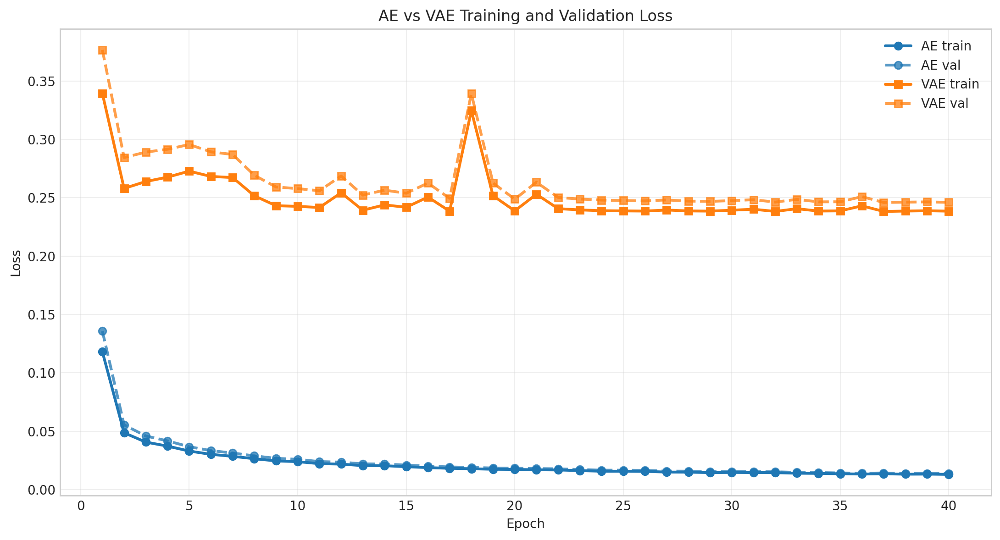

**Figure:** Design Decoder Training Curves

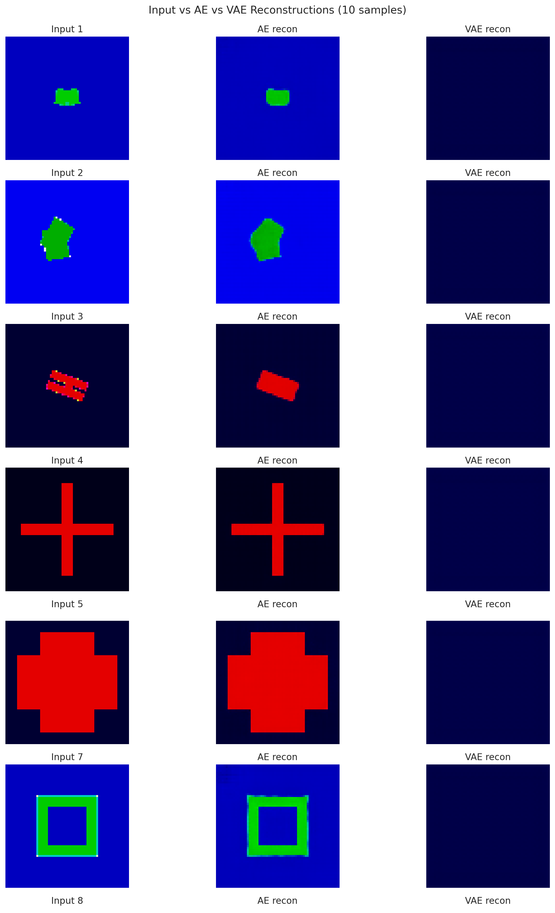

**Figure:** Design Decoder Samples

### Latent Diffusion Denoiser

The Latent Diffusion Model and Spectrum Encoder were trained jointly. As shown in Figure `diff_training`, the model exhibits healthy convergence throughout training.

Generated designs and their corresponding predicted spectra are shown in Figure `diff_samples`. Although the generated structures exhibit noticeable geometric variations, the predicted spectra remain close to the target spectra, demonstrating the model's ability to achieve spectrum-conditioned generation.

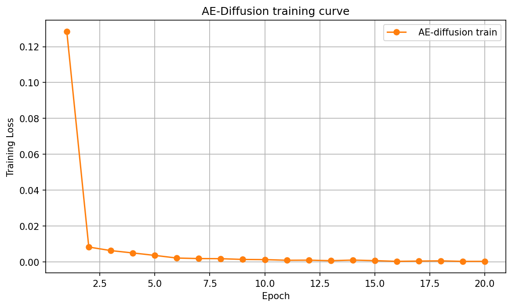

**Figure:** Diffusion Training Curve

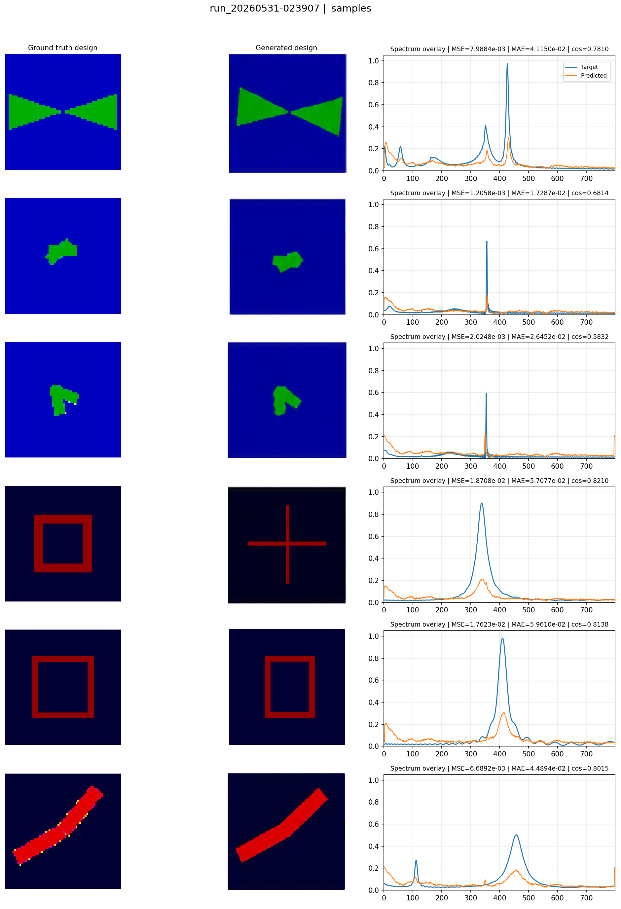

**Figure:** Diffusion Denoiser Samples

For further validation, the generated designs were post-processed using Gaussian filtering and binarization to isolate the structural features. These processed designs were then reconstructed and manually simulated in CST Studio Suite to obtain their absorption spectra. An example validation result is shown in Figure `diff_validation`.

The simulated spectra reveal mismatches in peak locations, the appearance of additional peaks, and other deviations from the target response. These discrepancies are likely introduced during the manual reconstruction and simulation process, which can introduce structural inaccuracies and simulation noise.

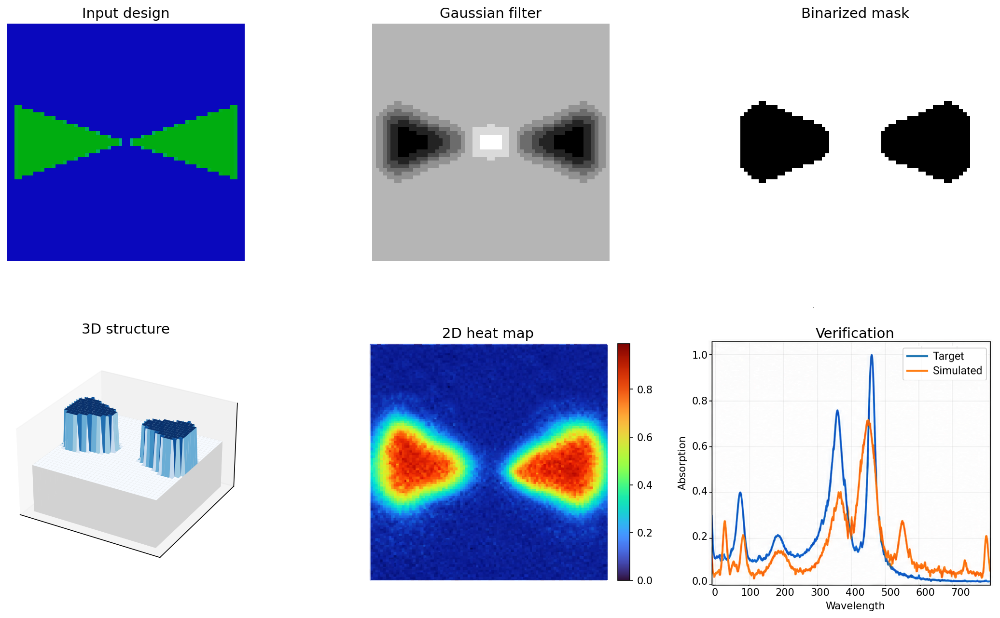

**Figure:** Diffusion Denoiser Sample Validation

The one-to-many generation capability of the proposed model is illustrated in Figure `one_to_many`. Although the visual diversity among generated designs remains limited, the variance is still sufficient to demonstrate multiple valid design solutions that produce similar spectral responses. Importantly, the generated spectra consistently maintain peak locations close to the target spectrum, highlighting the potential of diffusion-based approaches for inverse metamaterial design.

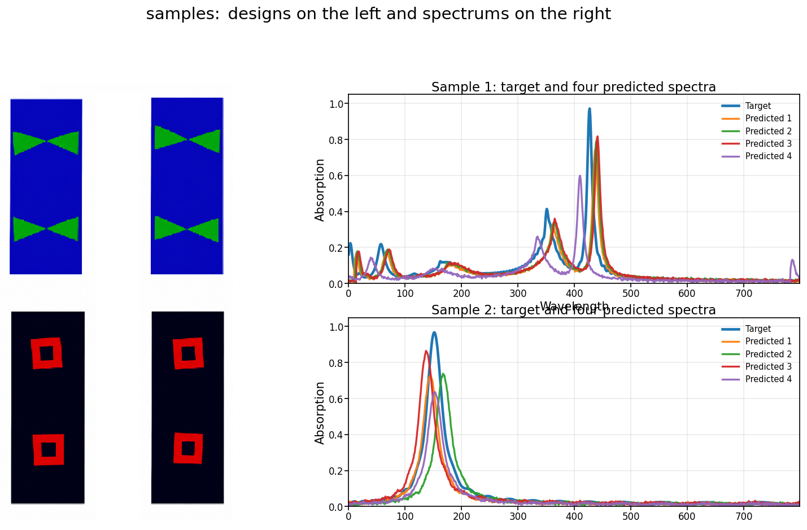

**Figure:** Diffusion Denoiser One-to-Many Validation

## Ablation Studies and Training Times

An ablation study was conducted to evaluate the contribution of different architectural components. The results are summarized in Table `ablation`.

The results indicate that the AE-based latent representation consistently outperformed the VAE-based alternative. Removing the guidance mechanism resulted in degraded performance, demonstrating its importance in targeted spectrum-conditioned generation. Furthermore, the use of Exponential Moving Average (EMA) during diffusion training provided a small but consistent improvement in model performance.

| Rank | Variant | Spectrum MSE |
|--------|---------|-------------|
| 1 | AE-Diffusion + EMA + Guidance | 0.00024 |
| 2 | AE-Diffusion + No EMA + Guidance | 0.00031 |
| 3 | AE-Diffusion + EMA + No Guidance | 0.00027 |
| 4 | AE-Diffusion + No EMA + No Guidance | 0.00035 |
| 5 | VAE-Diffusion + EMA + Guidance | 0.00042 |
| 6 | VAE-Diffusion + No EMA + Guidance | 0.00051 |
| 7 | VAE-Diffusion + EMA + No Guidance | 0.0046 |
| 8 | VAE-Diffusion + No EMA + No Guidance | 0.0056 |

The Forward Predictor required approximately 15–20 minutes of training on average. The Autoencoder components required roughly 1–1.5 hours of training. Since the diffusion model converged relatively quickly, training the Latent Diffusion Denoiser required only 2–2.5 hours.

## Conclusions and Future Work

Inverse design of metamaterials is traditionally a computationally expensive and iterative process, particularly when targeting specific spectral responses. Artificial intelligence techniques have increasingly been explored to address this challenge, and the present work contributes directly to this growing area of research.

Building upon previous advances in diffusion-based inverse design, this work focuses on reducing the computational burden associated with physics-guided generation. To achieve this, a lightweight Forward Predictor was employed as a surrogate guidance mechanism during diffusion.

The proposed framework successfully trained both the Forward Predictor and Autoencoder modules, demonstrating their effectiveness through qualitative and quantitative evaluations. The Latent Diffusion Model was able to generate designs whose predicted spectra closely matched the target spectra. Validation through electromagnetic simulation further demonstrated the potential applicability of the generated designs, although the current validation process remains limited by manual reconstruction and simulation procedures.

The ablation study confirmed that the selected architectural components contribute positively to overall performance and are necessary for achieving optimal results.

Future work will focus on incorporating noise-based augmentations during the training of both the Autoencoder and Forward Predictor to improve robustness. Additional modifications to the attention mechanism will also be investigated to further improve generation quality. Furthermore, approximately 500 out-of-distribution (OOD) samples are currently being collected and will be used to rigorously evaluate and validate the proposed architecture before conducting final large-scale experiments.
